# 🏩 buy-seoul — 부동산 통합 분석 서비스 (클라이언트)

`buy-seoul`은 서울 지하철 접근성과 실거리가 데이터를 기본으로
**예산에 맞는 추천 지역**과 **트렌드 분석**을 제공하는 부동산 분석 서비스입니다.

본 문서는 프론트엔드 구조와 현재 구현된 주요 기능을 설명합니다.

---

## 🔍 주요 기능

### 1. 지하철 기반 지역 추천

* 예산, 출발역, 최대 소요시간 조건을 입력하여 추천 지역 검색
* 추천 결과는 카드 리스트 및 지도 기반 시각화로 출력
* 지역 카드 클릭 시 상세 정보 모달 또는 별도 페이지로 이동

### 2. 지역별 실거리가 트렌드 조회

* 특정 지역 선택 시, 시계열 실거리가 통계 확인 가능
* 지역 상세 보기와 동일한 컨포넌트를 공유

### 3. 공통 지역 상세 페이지

* 검색 결과 페이지와 통계 페이지 모두 `/district/:code` 경로로 이동
* 상세 페이지 내에서 실거리 트렌드도 포함

---

## 📈 전체 기능 후류 (Mermaid)

```mermaid
flowchart TD
  Start[홈 화면]

  Start --> SearchPage[검색 페이지]
  SearchPage --> InputForm[조건 입력 폼]
  InputForm --> | 예산, 출발역, 거리 | Submit[검색 버튼 클릭]
  Submit --> ResultPage[추천 결과 페이지]
  ResultPage --> DistrictCardList[지역 추천 카드 리스트]
  DistrictCardList --> | 상세 보기 클릭 시 | DistrictDetail[지역 상세 페이지 / 모달]
  DistrictDetail --> TrendChart[거리가 시계열 그래프]
  ResultPage --> MapView[지도에서 위치 시각화]

  Start --> AboutPage[서비스 소개 / 설명 페이지]
```



---

## 🧱 기술 스택

* **Vue 3** + Composition API
* **Vite** + TypeScript
* **Pinia** (상태 관리)
* **Vue Router**
* **Axios**
* **Chart.js** (`vue-chartjs` 활용 가능)
* **Leaflet.js** (`vue3-leaflet` 또는 기타 오픈소스 지도 라이브러리)

---

## 📁 프로젝트 구조

```
src/
├── components/
│   ├── search/         # 검색 조건 입력 폼
│   ├── result/         # 추천 결과 리스트 및 카드
│   ├── district/       # 지역 상세 및 트렌드 그래프
│   └── common/         # 공통 UI 컨포넌트 (버튼, 모달 등)
├── pages/
│   ├── SearchPage.vue
│   ├── ResultPage.vue
│   ├── DistrictDetail.vue
│   └── AboutPage.vue
├── stores/             # Pinia 상태 관리
├── composables/        # 재사용 가능한 로직 (e.g. useSearch)
├── router/             # Vue Router 설정
└── main.ts
```

---

## 🚧 향후 개정 예정

* [ ] 검색 조건 ↔ URL 케리 동기화
* [ ] 모바일 반응형 UI 최적화
* [ ] 검색 결과 로딩 시 스케레톤 적용
* [ ] 사용자 히스토리 / 즐겨찾기 기능
* [ ] 컨포넌트 단위 테스트 추가

---

## 💬 문의 및 기여

본 프로젝트에 대한 제안, 기여, 피드백은 언제든 환영합니다.
개선 사항이 있다면 [Issue](https://github.com/buy-seoul-client/issues) 또는 PR로 남겨주세요.
